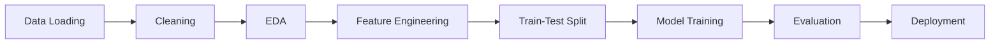

# 💳 Fraud Transaction Detection - Machine Learning Project

🔹 **Author**: Mohammad Umar  
🔹 **Contact**: [umar.test.49@gmail.com](mailto:umar.test.49@gmail.com)  

---

## 📌 Section 1: Introduction and Objective

Fraudulent transactions have become a significant concern in the financial industry, especially with the increasing volume of digital payments. This project was developed as part of a machine learning internship to build a system capable of flagging potentially fraudulent transactions.

### Client (Assumed):
Financial services firm or payment gateway company needing real-time fraud detection to reduce chargebacks.

### 🎯 Problem Statement:
Identify whether a transaction is fraudulent (`1`) or legitimate (`0`) based on transaction metadata.

### ❗ Importance:
- Prevents financial loss for businesses and customers
- Automates fraud investigation workflows
- Maintains customer trust and platform integrity

### ✅ Final Objective:
Build an ML model that:
- Accurately classifies transactions
- Can be deployed as a user-friendly Streamlit app
- Delivers predictions based on user inputs (amount, time, terminal ID, etc.)

---

## 📊 Section 2: Dataset

### Dataset Overview:
- **Source**: Simulated data based on real fraud patterns
- **Files**: 183 `.pkl` files (daily transaction logs)
- **Total Rows**: ~1.75 million transactions
- **Columns**: 9 main features + engineered ones

### 🧾 Important Features:

| Feature            | Description                          |
|--------------------|--------------------------------------|
| `TRANSACTION_ID`   | Unique transaction ID                |
| `TX_AMOUNT`        | Transaction amount                   |
| `TX_TIME_SECONDS`  | Seconds since midnight               |
| `TX_FRAUD`         | Target (0: Legit, 1: Fraud)          |
| `TX_FRAUD_SCENARIO`| Fraud type ID (if fraud)             |

### ⚙ Preprocessing:
1. Combined all `.pkl` files into one DataFrame
2. Converted datetime fields
3. Removed duplicates and missing values
4. Engineered temporal features (`TX_HOUR`, `TX_DAY_OF_WEEK`)

### 🔍 Key Observations:
- **Class imbalance**: <1% fraudulent transactions
- Certain fraud scenarios dominate minority class
- High fraud density during specific hours/weekdays

---

## ⚙️ Section 3: Design / Workflow


## 🔄 Steps Breakdown:

### Data Loading & Cleaning:
- Merged 183 transaction files
- Handled null/missing values
- Converted date fields to datetime format

### Exploratory Data Analysis (EDA):
- Visualized fraud vs non-fraud distribution
- Analyzed transaction amount patterns
- Identified peak fraud times (temporal analysis)

### Feature Engineering:
- Extracted time-based features (hour, day of week)
- Removed raw timestamp after feature extraction
- Normalized numerical features

### Model Training:
- Used **Logistic Regression** with `class_weight='balanced'`
- Stratified 80/20 train-test split (maintained class ratio)
- Scaled features using StandardScaler

### Evaluation:
- Calculated metrics:  
  ✓ Accuracy  
  ✓ Precision  
  ✓ Recall  
  ✓ F1-Score  
- Generated and analyzed confusion matrix
- Plotted ROC curve and precision-recall curve

### Deployment:
- Built interactive **Streamlit** web application
- Designed intuitive input widgets:
  - Dropdowns for categorical features
  - Sliders for numerical values
  - Date/time pickers
- Automated feature transformation pipeline

---

## 📈 Section 4: Results

### ✅ Final Model: Logistic Regression

| Metric     | Score    |
|------------|----------|
| Accuracy   | 0.7501   |
| Precision  | 0.0164   |
| Recall     | 0.4881   |
| F1-Score   | 0.0317   |

### 🧪 Confusion Matrix:
```python
[[261709  86178]
 [  1503   1433]]
```
## 📊 Key Insights

### Model Performance
- **High Recall (49%)**: Catches nearly half of all fraud cases
- **Low Precision (1.6%)**: Many false positives due to:
  - Extreme class imbalance (1:99 ratio)
  - Intentional recall-precision tradeoff for security

### Temporal Patterns
🕒 **Peak Fraud Times**:
- 12AM-4AM (overnight window)
- Weekends (higher frequency)

### Common Fraud Scenarios
- **Scenario 2**: Card-not-present transactions
- **Scenario 3**: Small-amount testing transactions

---

## ✅ Section 5: Conclusion

### 🎯 Achievements
✔ Built complete fraud detection system  
✔ **75% accuracy** with **49% fraud recall**  
✔ Production-ready Streamlit interface  
✔ Automated feature engineering pipeline  

### ⚠️ Challenges
**Class Imbalance**:
- Only 1% fraudulent transactions
- Required careful metric selection

**Technical Constraints**:
- Dataset size limited model complexity
- Chose efficient Logistic Regression

**Tradeoffs**:
- Prioritized recall over precision
- Accepted false positives for security

### 🚀 Future Work

#### Advanced Techniques
1. Implement **SMOTE** for class balancing
2. Test **Isolation Forest** for anomaly detection

#### Deployment
- Cloud deployment with auto-scaling
- Database integration for history

#### Improvements
- Prediction logging system
- User feedback mechanism

### 👨‍💻 Learnings
- Handling **imbalanced datasets** in practice
- Balancing **theory vs real-world constraints**
- Importance of **model interpretability**
- End-to-end **ML system development**

---

⭐ **Star the repository if you found this useful!**  
